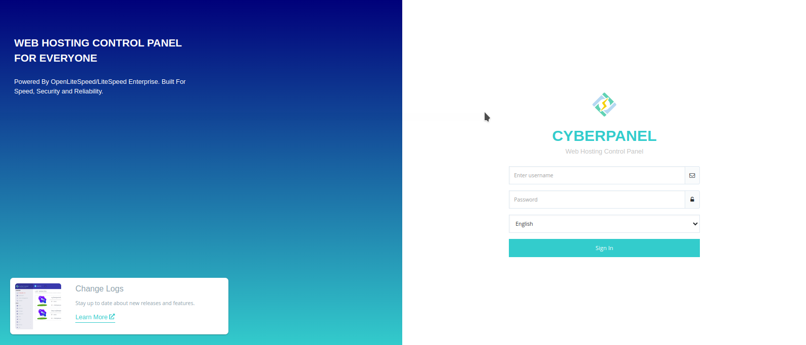
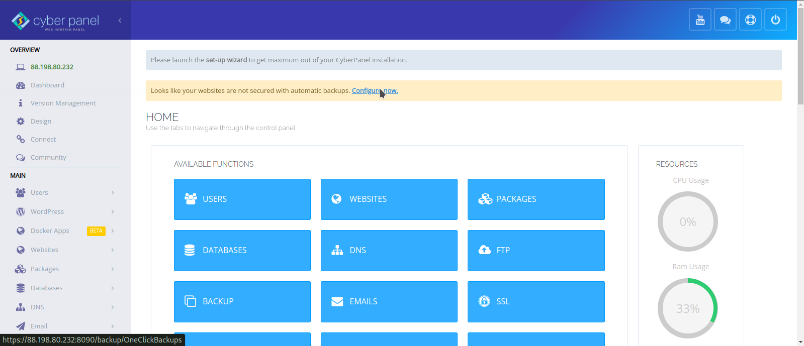

# CyberPannel-Documentation
Installation de Cyberpannel

# README: Installation et Configuration de CyberPanel avec Services de Messagerie

## Introduction
Ce guide explique comment installer **CyberPanel** sur un serveur Linux et configurer des services de messagerie complets pour plusieurs domaines, y compris la configuration de SSL et des enregistrements DNS essentiels.

---

## Prérequis
- Un serveur Linux (Ubuntu 20.04).
- Accès root ou sudo au serveur.
- Un nom de domaine configuré pour pointer vers le serveur.

---

## Installation de CyberPanel

### Étape 1 : Mettre à jour le serveur
Avant de commencer, mettez à jour votre serveur :
```bash
sudo apt update && sudo apt upgrade -y   # Pour Ubuntu/Debian
```


### Étape 2 : Installer CyberPanel
Exécutez la commande suivante pour télécharger et installer **CyberPanel** :
```bash
sudo sh <(curl -s https://cyberpanel.net/install.sh)

Username: admin
Password: REDf0x26?
```

### Étape 3 : Choisir les options d'installation
Pendant l'installation :
1. Choisissez **OpenLiteSpeed** (gratuit) ou **LiteSpeed Enterprise** (licence payante).
2. Activez l'option pour installer **Postfix** (service de messagerie).
3. Suivez les instructions pour définir un mot de passe admin.
Username: admin
Password: REDf0x26?
   
   

Une fois l'installation terminée, accédez à CyberPanel via `https://zera.cyberspector:8090`.

---

## Configuration du Domaine et SSL

### Étape 1 : Ajouter un domaine
1. Connectez-vous à **CyberPanel** (`https://zera.cyberspector:8090`).
2. Allez dans **Websites > Create Website**.
3. Remplissez les informations requises pour ajouter un domaine  pour chaque client.

### Étape 2 : Activer SSL pour le Domaine
1. Accédez à **Websites > List Websites**.
2. Sélectionnez le domaine et cliquez sur **Issue SSL** pour générer un certificat SSL Let's Encrypt.

---

## Configuration de la Messagerie

### Étape 1 : Créer un domaine de messagerie
1. Dans **CyberPanel**, allez dans **Email > Create Mail Domain**.
2. Sélectionnez le domaine du client, par exemple `cyber.cyber-spector.icu`.

### Étape 2 : Créer des comptes e-mail
1. Allez dans **Email > Create Email**.
2. Choisissez le domaine de messagerie, puis créez les adresses e-mail requises (par ex. `admin.cyber.cyber-spector.icu`).

### Étape 3 : Configurer les Enregistrements DNS (MX, SPF, DKIM)
Pour assurer une bonne délivrabilité des e-mails, configurez les enregistrements **MX**, **SPF**, **DKIM**, et **DMARC** pour le domaine du client :

- **Enregistrement MX** : Pointez vers `mail.cyber.cyber-spector.icu` avec une priorité de 10.
- **SPF** : Ajoutez l'enregistrement SPF pour autoriser votre serveur à envoyer des e-mails :
  ```
  v=spf1 mx ~all
  ```
- **DKIM** : Activez DKIM dans **Email > DKIM Manager** et suivez les instructions pour ajouter l'enregistrement DNS DKIM.
- **DMARC** (optionnel) :
  ```
  v=DMARC1; p=none; rua=mailto:dmarc-reports@cyber.cyber-spector.icu
  ```

---

## Tester les Services de Messagerie

1. **Accédez au Webmail** : Utilisez **Rainloop** inclus dans **CyberPanel** pour tester l'envoi et la réception d’e-mails.
   - Accédez via : `https://zera.cyberspector.xyz:8090/rainloop`.
2. **Tester avec des clients externes** : Connectez les comptes e-mail aux clients comme **Outlook** ou **Thunderbird** avec les paramètres suivants :
   - **Serveur SMTP** : `mail.client1.mondemo.com`, port 587 (TLS)
   - **Serveur IMAP** : `mail.client1.mondemo.com`, port 993 (SSL)

---

## Création de Panneaux d'Administration pour les Clients

1. **Créer un compte utilisateur pour chaque client** :
   - Allez dans **User Management > Create User** et créez un utilisateur pour chaque domaine client.
2. **Assigner des permissions** :
   - Associez chaque utilisateur à son domaine respectif pour leur permettre de gérer leurs propres services.

---

## Intégration & Automatisation avec WHMCS 

Intégration & automatiser la gestion des clients, la facturation et la création des comptes, envisagez d’intégrer **WHMCS** avec **CyberPanel**.

### Étape 1 : Uploader le Module de Cyberpanel
** Télécharger le fichier grace à 
```bash
git clone https://github.com/jetchirag/cyberpanel-whmcs.git cyberpanel
```
*** Extrait et uploader le dossier dans

cloudpilote>File Manager> Dossier de WHMCS > modules > Server 


### Étape 2 : Interconnexion
** Se rendre sur WHMCS > System Setting
** > Server > Create a New Group

** > Server >Create a New Server

** > Product Service > Create New groupe
** > Product Service > Create New service


---

## Conclusion

Votre serveur CyberPanel est maintenant configuré pour héberger plusieurs clients avec des services de messagerie complets, incluant SSL et les enregistrements DNS nécessaires pour une bonne délivrabilité. Testez régulièrement les services de messagerie pour vous assurer de leur bon fonctionnement.

--- 

## Ressources Additionnelles
- [Documentation officielle CyberPanel](https://cyberpanel.net/docs/)
- [Guide d’intégration WHMCS avec CyberPanel](https://cyberpanel.net/docs/whmcs-integration/)
